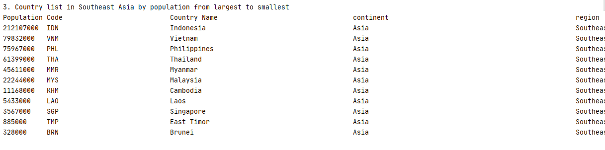

# Software Engineering Methods

- Master Build Status 
- Develop Build Status 
- License 
- Release 
- CodeCov 

| ID | Name | Met | Screenshot | 
| ---- | ----- | ----- | -------- |
| 1 | The list of country by population from largest to smallest. | Yes | 
| 2 | Country list in Asia by population from largest to smallest. | Yes | 
| 3 | Country list in Southeast Asia by population from largest to smallest. | Yes | 
| 4 | Top 10 populated countries in the world. | Yes | 
| 5 | Top 10 populated countries in Asia. | Yes | 
| 6 | Top 10 populated countries in Southeast Asia. | Yes | 
| 7 | City list in the world organized by population from largest to smallest. | Yes | 
| 8 | City list in a continent organized by population from largest to smallest. | Yes | 
| 9 | Top 10 pupulated cities in the world | Yes | 
| 10 | Top 10 pupulated cities in Asia continent. | Yes | 
| 11 | Top 10 pupulated cities in Eastern Asia region. | Yes | 
| 12 | City list in Southeast Asia organized by population from largest to smallest. | Yes | 
| 13 | City list in Japan organized by population from largest to smallest. | Yes | 
| 14 | City list in Osaka organized by population from largest to smallest. | Yes | 
| 15 | Top 10 pupulated cities in Japan country from largest to smallest. | Yes | 
| 16 | Top 10 pupulated cities in Chiba district from largest to smallest. | Yes | 

